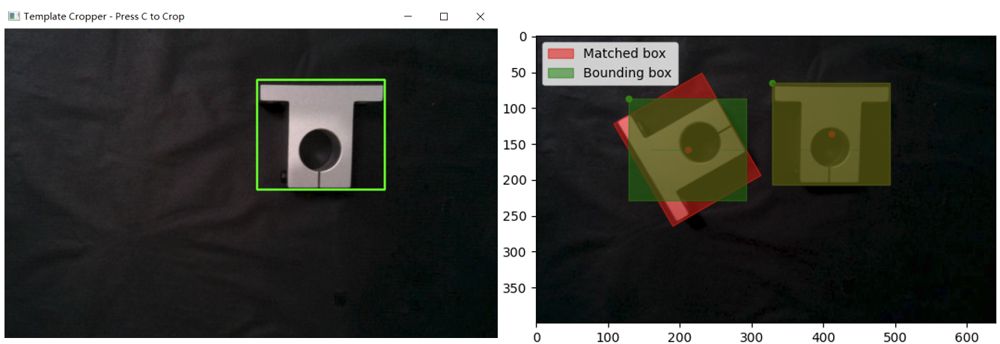

# Invariant-TemplateMatching

Demonstration:



Original post: https://forum.opencv.org/t/an-improved-template-matching-with-rotation-and-scale-invariant/

Template matching is a good method for quick object detection but the template matching algorithm provided by OpenCV is not able to detect rotated or scaled object in the match. Also it will generate many redundant matching boxes which are useless in robotic grasping or many other tasks. Therefore we proposed Invariant-TemplateMatching which made a few improvements for low-cost but robust object detection and grasp pose estimation on objects with different poses, sizes and colors. For implementation, after cropping the template (with GUI), by setting a range of rotate angles and scale factors, the matching process does a grid search on all possible combinations of rotate angles and scale factors. Also, the new algorithm eliminates redundant bounding boxes based on size of the template. Functionalities are packed into a new function. Additionally, the rotation angle can perform 2D pose estimation. The new algorithm makes the robotic grasping based on template matching robust on objects with different sizes and poses. Details can be found in the following paper.

## Quick Start
1. Set up the virtual environment:

```
conda env create -f requirements.yml
conda activate invarianttm
```

2. Run the default Invariant-TemplateMatching algorithm:

```
python main_default.py
```

3. Run the Invariant-TemplateMatching algorithm with color difference filtering (you might need to tune the 'rgbdiff_thresh' parameter):

```
python main_rgbdiff.py
```

## Citing this code
Please cite the following paper:

Z. Zhang and H. Shang, "[Low-cost Solution for Vision-based Robotic Grasping](https://ieeexplore.ieee.org/document/9757984)," 2021 International Conference on Networking Systems of AI (INSAI), 2021, pp. 54-61, doi: 10.1109/INSAI54028.2021.00022.

### BibTeX:

```
@inproceedings{zhang2021low,
  title={Low-cost solution for vision-based robotic grasping},
  author={Zhang, Zheyuan and Shang, Huiliang},
  booktitle={2021 International Conference on Networking Systems of AI (INSAI)},
  pages={54--61},
  year={2021},
  organization={IEEE}
}
```
